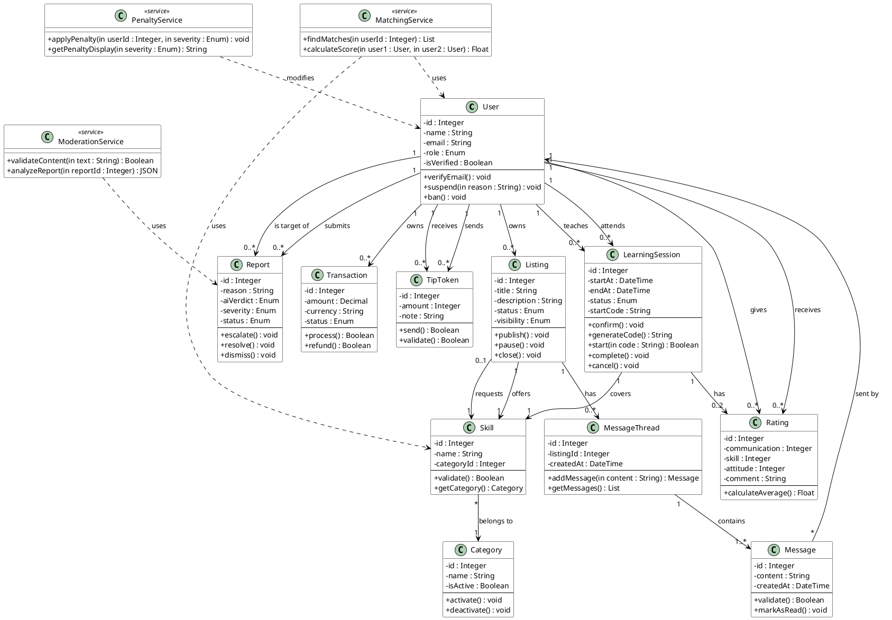

# SkillSwap - Academic UML Class Diagram

## Overview

This diagram represents the core domain model for SkillSwap, a peer-to-peer skill exchange platform. It focuses on **domain entities** and **business services**, excluding UI, controllers, and configuration layers.

---

## UML Class Diagram Structure

### Domain Entities

| Class | Key Attributes | Key Operations |
|-------|----------------|----------------|
| **User** | id, name, email, role, isVerified | verifyEmail(), suspend(), ban() |
| **Skill** | id, name, categoryId | validate(), getCategory() |
| **Category** | id, name, isActive | activate(), deactivate() |
| **Listing** | id, title, description, status, visibility | publish(), pause(), close() |
| **LearningSession** | id, startAt, endAt, status, startCode | confirm(), start(), complete(), cancel() |
| **Rating** | id, communication, skill, attitude, comment | calculateAverage() |
| **Message** | id, content, createdAt | validate(), markAsRead() |
| **MessageThread** | id, listingId, createdAt | addMessage(), getMessages() |
| **Report** | id, reason, aiVerdict, severity, status | escalate(), resolve(), dismiss() |
| **Transaction** | id, amount, currency, status | process(), refund() |
| **TipToken** | id, amount, note | send(), validate() |

### Core Business Services

| Service | Key Methods |
|---------|-------------|
| **MatchingService** | findMatches(), calculateScore() |
| **ModerationService** | validateContent(), analyzeReport() |
| **PenaltyService** | applyPenalty(), getPenaltyDisplay() |

---

## Associations & Multiplicity

```
User "1" ────────< "0..*" Listing          : owns
User "1" ────────< "0..*" LearningSession  : teaches (as teacher)
User "1" ────────< "0..*" LearningSession  : attends (as student)
User "1" ────────< "0..*" Rating           : gives (as rater)
User "1" ────────< "0..*" Rating           : receives (as ratee)
User "1" ────────< "0..*" Report           : submits (as reporter)
User "1" ────────< "0..*" Report           : is reported (as target)
User "1" ────────< "0..*" Transaction      : owns
User "1" ────────< "0..*" TipToken         : sends
User "1" ────────< "0..*" TipToken         : receives

Listing "1" ────────< "0..*" MessageThread : discusses
Listing "1" ────── "1" Skill              : offers
Listing "0..1" ────── "1" Skill           : requests (learnSkill)

Skill "0..*" ────── "1" Category          : belongs to

LearningSession "1" ────── "1" Skill      : covers
LearningSession "1" ────────< "0..2" Rating : has

MessageThread "1" ────────< "1..*" Message : contains
Message "1" ────── "1" User               : sender
```

---

## PlantUML Code



---

## Notes

- All attributes use `-` (private) visibility
- All operations use `+` (public) visibility
- Operations include `in` parameter directionality where applicable
- Separator `--` is used to divide attributes from operations in PlantUML
- Multiplicity follows UML standard: `1`, `0..1`, `0..*`, `1..*`
